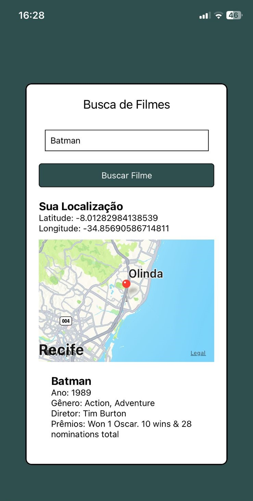

## 💻 Projeto

App React Native + API FIlmes + Geolocalização + Mapa, criado para a conclusão da atividade da cadeira de Coding Mobile.

O usuário poderá buscar informações sobre filmes ao mesmo tempo que o App solicita e mostra a real localização do dispositivo.

## Tecnologia

 
  

## Design  

 
